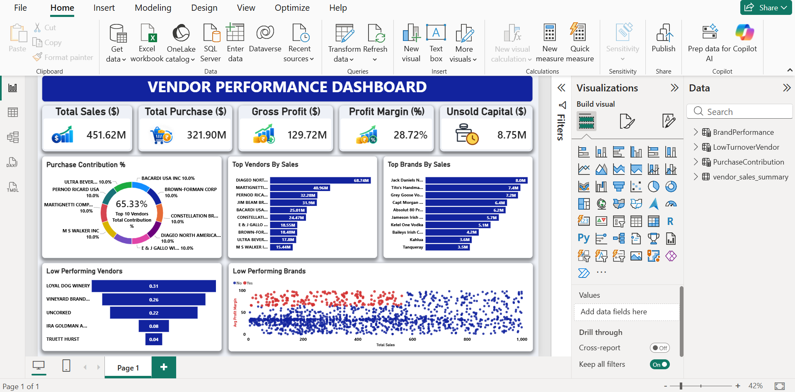

# Vendor Performance Analysis



## 📌 Project Overview
This project presents an end-to-end data analytics solution for analyzing vendor sales, procurement costs, profit margins, and unsold capital risk. By integrating **Python**, **SQL (PostgreSQL)**, and **Power BI**, it empowers business stakeholders to identify high-performing vendors, monitor brand distribution, and eliminate inefficiencies in inventory management.

---

## 📊 Key Business Metrics
- **Total Sales:** $451.62M
- **Total Purchase:** $321.90M
- **Gross Profit:** $129.72M
- **Profit Margin:** 28.72%
- **Unsold Capital:** $8.75M
- **Top 10 Vendors Purchase Contribution:** 65.33%

---

## 🛠️ Tech Stack & Tools Used
- **Data Ingestion & ETL:** Python (`Pandas`, `SQLAlchemy`, `PostgreSQL`)
- **Exploratory Data Analysis (EDA):** Python (`Pandas`, `Matplotlib`, `Seaborn`)
- **Database Management:** PostgreSQL 16 / pgAdmin 4
- **Data Visualization & BI:** Power BI (`DAX`, `Power Query`, `Data Modeling`)

---

## 📂 Repository Structure

```text
Vendor_Performance_Analysis_Project/
│
├── logs/                      # System logs for ingestion and data execution
│   ├── ingestion_db.log
│   └── get_vendor_summary.log
│
├── scripts/                   # Python scripts for data ingestion and automation
│   └── ingestion_db.py
│
├── notebooks/                 # Jupyter Notebooks for exploratory data analysis
│   ├── Exploratory Data Analysis.ipynb
│   └── Vendor Performance Analysis.ipynb
│
├── Vendor_Performance_Dashboard.pbix   # Power BI Dashboard file
├── get_vendor_summary.txt              # Vendor metric summary text output
├── dashboard_preview.png               # High-resolution dashboard view
└── README.md                           # Project documentation
